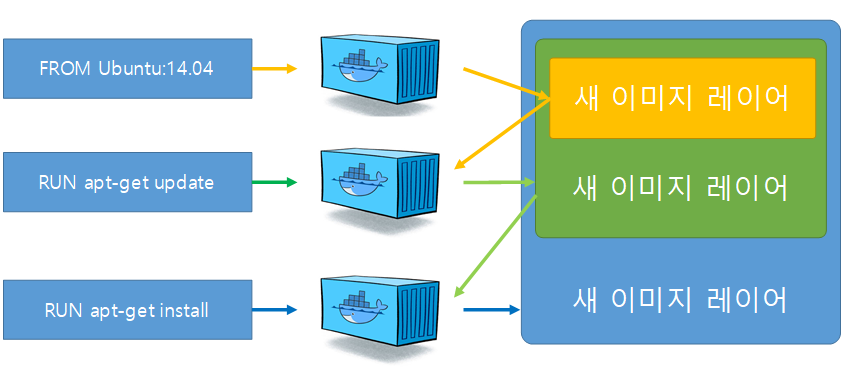

# Dockerfile 빌드

## 이미지 생성
- 빌드 명령어
    ```bash
    docker build -t mybuild:0.0 ./
    ```
    - -t 옵션은 생성될 이미지의 이름 설정
    - -t 옵션을 사용하지 않으면 16진수 형태의 이름으로 이미지가 저장된다.
    - build 명령어 끝에는 Dockerfile이 저장된 경로를 입력한다. 일반적으로 로컬에 저장된 Dockerfile을 사용하지만 외부 URL로 부터 Dockerfile의 내용을 가져와 빌드할 수도 있다.
- 빌드 확인
    ```
    docker images
    ```
    - 실행해보면 방금 만든 mybuild라는 이름의 이미지가 생성된다.
- 생성된 이미지로 컨테이너 실행
    ```
    docker run -d -P --name myserver mybuild:0.0
    ```
    - -P 옵션은 이미지에 설정된 EXPOSE의 모든 포트를 호스트에 연결하도록 설정한다. 이때 호스트에서 사용 가능한 포트에 차례로 연결하므로 'docker port myserver', 'docker ps'와 같은 명령어로 어느 포트를 사용중인지 확인할 필요가 있다.
    - Dockerfile에 이미지의 라벨을 purpose=practice로 설정했으므로 docker images 명령어의 필터에 이 라벨을 적용할 수 있다. 'docker images --filter "label=purpose=practice"'를 통해 해당 라벨을 가지는 이미지를 출력할 수 있다.

## 빌드 과정 살펴보기
```
# docker build -t mybuild:0.0 ./

[+] Building 72.2s (11/11) FINISHED                   docker:desktop-linux
 => [internal] load build definition from Dockerfile                  0.0s
 => => transferring dockerfile: 314B                                  0.0s
 => [internal] load metadata for docker.io/library/ubuntu:14.04       0.8s
 => [internal] load .dockerignore                                     0.0s
 => => transferring context: 2B                                       0.0s
 => [1/6] FROM docker.io/library/ubuntu:14.04@sha256:64483f3496c1373  7.4s
 => => resolve docker.io/library/ubuntu:14.04@sha256:64483f3496c1373  0.0s
 => => sha256:55b7b4f7c5d6a56a3ccb5e93538311838599b6 3.33kB / 3.33kB  0.0s
 => => sha256:d1a5a1e51f251c3431dec02e2cc8d157e92d 66.47MB / 66.47MB  4.8s
 => => sha256:75f8eea31a63686c11aa74b7df6da0f6450a 59.10kB / 59.10kB  0.6s
 => => sha256:a72d031efbfb01751d5de3b287566e7d7f33697674 187B / 187B  0.5s
 => => sha256:64483f3496c1373bfd55348e88694d1c4d0c9b 1.20kB / 1.20kB  0.0s
 => => sha256:5ed16aa332467821529d451800e6fe599d83e30471 945B / 945B  0.0s
 => => extracting sha256:d1a5a1e51f251c3431dec02e2cc8d157e92d1b46913  2.5s
 => => extracting sha256:75f8eea31a63686c11aa74b7df6da0f6450afbee2c9  0.0s
 => => extracting sha256:a72d031efbfb01751d5de3b287566e7d7f33697674a  0.0s
 => [internal] load build context                                     0.0s
 => => transferring context: 41B                                      0.0s
 => [2/6] RUN apt-get update                                         52.9s
 => [3/6] RUN apt-get install apache2 -y                             11.0s
 => [4/6] ADD test.html /var/www/html                                 0.0s
 => [5/6] WORKDIR /var/www/html                                       0.0s
 => [6/6] RUN ["/bin/bash", "-c", "echo hello >> test2.html"]         0.1s
 => exporting to image                                                0.1s
 => => exporting layers                                               0.1s
 => => writing image sha256:c8d60a2e24d7c60d4cc0aff51e74fb9e569949fa  0.0s
 => => naming to docker.io/library/mybuild:0.0
```
- build 명령어를 입력했을 때 다양한 내용이 출력되었으며, 내용 중 대부분은 Dockerfile의 RUN을 실행해 컨테이너 내부에서 발생한 표준 출력이지만 이미지를 생성하는 부분은 조금 눈여겨볼 필요가 있다.
- 빌드 컨텍스트
```
        빌드 컨텍스트(Dockerfile이 위치한 경로의 파일들)[test.html]
                            |
                            |
                            \/
디렉토리: ./  -> Docker image[FROM ubuntu:14.04 RUN ~~~]  -> 새로운 이미지(myapp:0.0)

```
- 이미지 빌드를 시작하면 도커는 가장 먼저 빌드 컨텍스트를 읽는다.
- 빌드 컨텍스트는 이미지를 생성하는 데 필요한 각종 파일, 소스코드, 메타 데이터 등을 담고 있는 디렉토리를 의미하며, Dockerfile이 위치한 디렉토리 빌드 컨텍스트가 된다.
- ADD, COPY 같은 명령어들은 빌드 컨텍스트의 파일을 이미지에 추가하는 명령어 이다.

> 위 예에서는 경로를 ./로 지정함으로써 test.html 파일을 빌드 컨텍스트에 추가했으며, ADD 명령어를 통해 빌드 컨텍스트에서 test.html 파일을 이미지에 추가했다.

> 책에서는 build context를 제일 먼저 읽는다고 하였는데 실제 결과는 그런거 같지는 않다.

- 컨텍스트는 build 명령어의 맨 마지막에 지정된 위치에 있는 파일을 전부 포함하며, Git과 같은 외부 URL에서 Dockerfile을 읽어 들인다면 해당 Repository에 있는 파일과 서브 모듈을 포함한다. 
- 따라서 Dockerfile이 위치한 곳에는 이미지 빌드에 필요한 파일만 존재해야 하며 루트 디렉토리(/)와 같은 곳에서 이미지를 빌드하지 않도록 주의해야한다.
- 또한 .dockerignore 파일을 사용할 수도 있다.
    ```
    test.html
    *.html
    */*.html
    test.htm?
    ```
    - ./*.html에 해당하는 모든 파일을 제외한다.
    - ?은 test.htm을 접두어로 두고 '?' 자리에 임의의 1자리 문자가 들어가는 파일을 제외한다.
- 특수한 파일만 포함하도록 설정하고 싶다면 '!'를 사용할 수 있다.
    ```
    *.html
    !test*.html
    ```
    - 확장자가 html인 파일을 모두 제외하지만 test로 시작하는 html 파일은 컨텍스트에서 제외하지 않는다.


### Dockerfile을 이용한 컨테이너 생성과 커밋
- build 명령어는 Dockerfile에 기록된 대로 컨테이너를 실행한 뒤 완성된 이미지를 만들어내지만,
이미지로 만드는 과정이 하나의 컨테이너에서 일어나는 것은 아니다.
- Dockerfile에서 명령어 한 줄이 실행될 때마다 이전 step에서 생성된 이미지에 의해 새로운 컨테이너가 생성되며, Dockerfile에 적힌 명령어를 수행하고 다시 새로운 이미지 레이어로 저장된다.



- 따라서 이미지의 빌드가 완료되면 Dockerfile의 명령어 줄 수만큼의 레이어가 존재하게 되며, 중간에 컨테이너도 같은 수만큼 생성되고 삭제된다.

### 캐시를 이용한 이미지 빌드
- 한 번 이미지 빌드를 마치고 난 뒤 다시 같은 빌드를 진행하면 이전의 이미지 빌드에서 사용했던 캐시를 사용한다.

- Dockerfile2를 생성해보자, 이전의 Dockerfile의 앞의 일부 내용을 가져왔다.
```
FROM ubuntu:14.04
LABEL maintainer "covy <covy@gmail.com>"
LABEL "purpose"="practice"
RUN apt-get update
```

- 그리고 실행해보면, 캐시를 쓴 것을 볼 수 있다.
```
# docker build -f Dockerfile2 -t mycache:0.0 ./

[+] Building 1.7s (7/7) FINISHED                                                                                                 docker:desktop-linux
 => [internal] load build definition from Dockerfile2                                                                                            0.0s
 => => transferring dockerfile: 143B                                                                                                             0.0s
 => [internal] load metadata for docker.io/library/ubuntu:14.04                                                                                  1.7s
 => [auth] library/ubuntu:pull token for registry-1.docker.io                                                                                    0.0s
 => [internal] load .dockerignore                                                                                                                0.0s
 => => transferring context: 2B                                                                                                                  0.0s
 => [1/2] FROM docker.io/library/ubuntu:14.04@sha256:64483f3496c1373bfd55348e88694d1c4d0c9b660dee6bfef5e12f43b9933b30                            0.0s
 => CACHED [2/2] RUN apt-get update                                                                                                              0.0s
 => exporting to image                                                                                                                           0.0s
 => => exporting layers                                                                                                                          0.0s
 => => writing image sha256:59e4b5c3ec721cfc2e87f55b87ff242f5a33616afff1fcbf3f778ad76758c9bf                                                     0.0s
 => => naming to docker.io/library/mycache:0.0
```

> 이전에 빌드했던 Dockerfile에 같은 내용이 있다면 build 명령어는 이를 새로 빌드하지 않고 같은 명령어 줄까지 이전에 사용한 이미지 레이어를 활용해 이미지를 생성한다.

### --no-cache

- 하지만 때로 캐시 기능이 필요하지 않을 때가 있다. 예를 들어 git clone 명령어를 사용해 빌드할때 실제 깃 저장소에서 리비전 관리가 일어나도 매번 빌드를 할 때마다 고정된 소스코드를 사용할 것이다.
- 이 경우 캐시를 사용하지 않기 위해 build 명령어에 --no-cache 옵션을 추가하면 된다.

```
docker build --no-cache -t mybuild:0.0 ./
```

### --cache-from
- 캐시로 사용할 이미지를 직접 지정도 가능하다.
- 특정 Dockerfile을 확장해서 사용한다면 기존의 Dockerfile로 빌드한 이미지를 빌드 캐시로 사용할 수 있다.
- 예를 들어, 도커 허브의 nginx 공식 저장소에서 nginx:latest 이미지를 빌드하는 Dockerfile에 일부 내용을 추가해 사용한다면 로컬의 nginx:latest 이미지를 캐시로 사용할 수 있다.
```
docker build --cache-from nginx -t my_extend_nginx:0.0 .
```


## 멀티 스테이지를 이용한 Dockerfile 빌드하기
- 멀티 스테이지를 이용해 이미지의 크기를 줄여보자.
- 먼저 Hello World를 출력하는 간단한 Go 소스코드를 작성해보자.
- main.go
    ```
    package main
    import "fmt"
    func main(){
        fmt.Println("hello world")
    }
    ```
- golang 이미지를 기반으로 main.go를 컴파일하고 출력 프로그램을 실행하는 Dockerfile
    ```
    FROM golang
    ADD main.go /root
    WORKDIR /root
    RUN go build -o /root/mainApp /root/main.go
    CMD ["./mainApp"]
    ```
- Go로 작성된 소스코드를 빌드하기 위해서는 Go와 관련된 빌드 툴과 라이브러리가 미리 설치되어 있어야 한다. 위의 도커파일을 실행해보고 이미지의 크기를 확인해보겠다.
    ```
    # docker build -f DockerfileGo . -t go_helloworld
    # docker images
    REPOSITORY                       TAG       IMAGE ID       CREATED          SIZE
    go_helloworld                    latest    d212ef166456   12 seconds ago   859MB
    ```
- 단순히 Hello World를 출력하는 프로그램을 실행하는 이미지이지만 크기가 800MB에 달하는 것을 알 수 있다.

- Mulit-stage 빌드 방법을 사용하여 이미지 크기를 줄여보겠다. 멀티 스테이지 빌드는 하나의 Dockerfile 안에 여러 개의 FROM 이미지를 정의함으로써 빌드 완료 시 최종적으로 생성될 이미지의 크기를 줄이는 역할을 한다.
    ```
    FROM golang
    ADD main.go /root
    WORKDIR /root
    RUN go build -o /root/mainApp /root/main.go

    FROM alpine:latest
    WORKDIR /root
    COPY --from=0 /root/mainApp .
    CMD ["./mainApp"]
    ```

- 그리고 빌드를 해서 이미지의 크기를 확인해보면 이미지의 크기가 엄청나게 줄어든 것을 알 수 있다. 두 번째 FROM 아래에서 사용된 COPY 명령어는 첫 번째 FROM에서 사용된 이미지의 최종 상태에 존재하는 /root/mainApp 파일을 두 번쨰 이미지인 alpine:latest에 복사한다.
    ```
    # docker build . -t go_helloworld:multi-stage -f DockerfileGo2
    # docker images
    REPOSITORY                       TAG           IMAGE ID       CREATED         SIZE
    go_helloworld                    multi-stage   d8fd4f747e67   3 seconds ago   10.8MB
    go_helloworld                    latest        d212ef166456   5 minutes ago   859MB
    ```

- 이와 같이 멀티 스테이지 빌드는 반드시 필요한 실행 파일만 최종 이미지 결과물에 포함시킴으로써 이미지 크기를 줄일 때 유용하게 사용할 수 있다.

> alpine이나 busybox와 같은 이미지는 우분투나 CentOS에 비해 이미지 크기가 매우 작지만 기본적인 프로그램 실행에 필요한 필수적인 런타임 요소가 포함되어 있는 리눅스 배포판 이미지이다. 이러한 이미지를 활용하면 경량화된 애플리케이션 이미지를 간단히 생성할 수 있다는 장점이 있다.

> 참고로 --from=0, --from=1은 FROM에서 명시된 순서대로 0, 1의 순으로 차례되어 구분되어 사용된다. 'FROM golang as builder' 와 같은 as를 사용함으로써 '--from=builder'로도 사용이 가능하다.